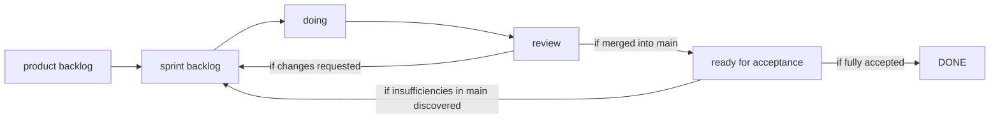

# Trello

| Trello Link                                   |
| --------------------------------------------- |
| https://trello.com/b/ZgcM7V1K/closest-nursery |

## Workflow

## Workflow description

1. All new tasks are added to the `product backlog` (which should be reviewed/filtered/sorted by priority at each call).
2. Tasks in `product backlog` do not have to have a developer assigned to them, but if someone knows in advance that they will
   want to work on it, they can assign themselves to the task.
3. From the `product backlog`, we select tasks for the sprint.
4. Each task in `sprint backlog` must have a developer assigned to it so that it is clear who will be working on it.
5. The developer moves the tasks from `sprint backlog` to `doing` if she/he started to work on the task already.
6. The task is moved to `review` if there is a PR created, which goes through all the builds and is already in a good
   enough state for review.
7. If the PR is approved and merged into main, the task is moved to `ready for acceptance`. Otherwise, it is moved back to
   `sprint backlog` with requested changes.
8. After the PR is merged, it is moved to `ready for acceptance`. A person who did not review the PR looks at the finished
   product in main and tries to interact with it as a user.
9. If they find any bugs, they either create new tasks in the `product backlog` and move the current task to `DONE` or
   return the entire task back to `sprint backlog`. If they do not find any bugs, they just move it to `DONE` as fully accepted.
